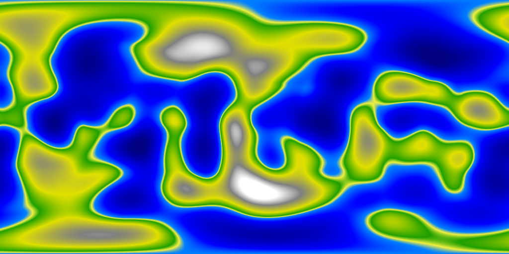

## Bounds
### Mapa Regular

### Bound NO

### Bound NE

### Bound SO

### Bound SE

## Frequency, Octave, Persistency
### F2 O1 P0.25

### F2 O4 P0.50

### F4 O2 P0.50

### F4 O4 P0.25

### F4 O4 P0.50

### F4 O4 P0.75

### F4 O8 P0.50

### F6 O4 P0.50

### F8 O8 P0.75

## Biomas
### Biomas de calor extremo

### Biomas de frio extremo

